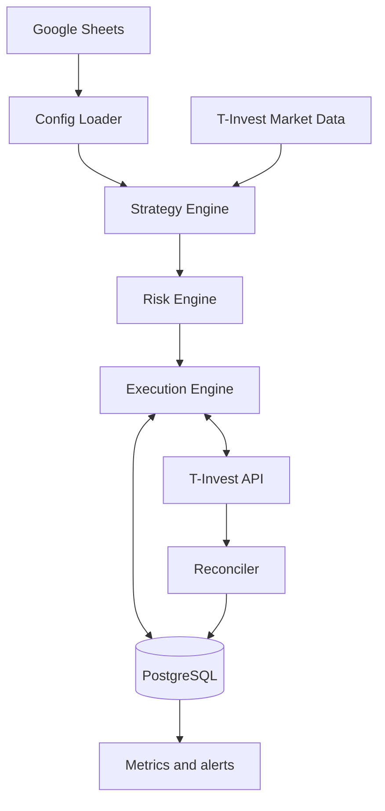

# Ladder Trader

Сервис автоматизированного исполнения биржевой «лесенки» из Google Sheets через T‑Invest API.

Статус: документация `draft / implementation-ready`, этап 1 реализации начат. Реальная торговля запрещена.

Сейчас реализованы безопасный Go-каркас, принудительный startup в `disabled`, PostgreSQL migration runner, начальная схема данных, health/readiness/status endpoints и Compose-окружение. Broker и Google Sheets adapters ещё отсутствуют, поэтому торговые команды архитектурно недоступны.

## Цель

Перенести текущую модель из таблицы «Лесенки PRO» в воспроизводимый и контролируемый процесс:

1. Пользователь меняет параметры лесенки в Google Sheets.
2. Сервис читает только опубликованную ревизию конфигурации.
3. Go-код независимо проверяет и рассчитывает торговый план.
4. Risk Engine разрешает или блокирует каждое действие.
5. Execution Engine идемпотентно выставляет лимитные заявки через T‑Invest API.
6. PostgreSQL хранит фактическое состояние заявок, сделок и циклов стратегии.

Google Sheets является control plane, но не источником факта исполнения. Источник факта — брокер, локально зафиксированный в PostgreSQL.

## MVP

- Один брокерский счёт.
- Инструменты: `SBER`, `TRNFP`, `BTBR`.
- Только длинные позиции.
- Только лимитные DAY-заявки.
- Без маржинальной торговли и коротких позиций.
- Режимы: `disabled`, `dry_run`, `sandbox`, `live`.
- Переход в `live` не выполняется автоматически после рестарта.
- Базовые позиции по умолчанию защищены от продажи до отдельного решения.
- Вкладка `Крипта`, ЦФА и прочие инструменты не входят в MVP.

## Принцип работы одного цикла

1. Сервис публикует BUY-заявки для активных уровней лесенки в пределах зарезервированного бюджета.
2. После первого исполнения появляется актуальная SELL-заявка выхода.
3. Если до продажи исполняется более глубокий уровень, SELL-заявка пересчитывается и заменяется.
4. После исполнения выхода цикл закрывается, оставшиеся BUY-заявки отменяются.
5. Автоматический запуск нового цикла в MVP отключён: требуется новая опубликованная ревизия или ручная команда.

## Архитектура



## Предлагаемая структура репозитория

```text
cmd/trader/
internal/config/
internal/sheets/
internal/tinvest/
internal/instruments/
internal/marketdata/
internal/strategy/
internal/risk/
internal/execution/
internal/reconcile/
internal/storage/
internal/notify/
internal/metrics/
migrations/
deploy/
docs/
```

## Локальный запуск каркаса

Создай локальный Docker secret, исключённый из Git, и проверь Compose-конфигурацию:

```bash
make infra-init
make infra-config
```

Затем запусти PostgreSQL, миграции и trader:

```bash
make infra-up
```

Проверка процесса:

```bash
curl http://127.0.0.1:8080/healthz
curl http://127.0.0.1:8080/readyz
curl http://127.0.0.1:8080/v1/status
curl http://127.0.0.1:9090/metrics
```

В `status` поле `effective_mode` всегда остаётся `disabled`, а `trading_ready` — `false`.

Операционные команды:

```bash
make infra-status
make infra-check
make infra-logs
make infra-down   # сохраняет PostgreSQL volume
```

## Документы

- [Архитектура](docs/architecture/overview.md)
- [Торговый автомат](docs/architecture/trading-state-machine.md)
- [Модель данных](docs/architecture/data-model.md)
- [Контракт Google Sheets](docs/integrations/google-sheets.md)
- [Интеграция с T‑Invest API](docs/integrations/tinvest.md)
- [Риск-контроль и безопасность](docs/operations/risk-and-security.md)
- [Стратегия тестирования](docs/operations/testing.md)
- [Развёртывание](docs/operations/deployment.md)
- [Roadmap](docs/planning/roadmap.md)
- [Открытые вопросы](docs/planning/open-questions.md)

## Definition of Done для MVP

- Расчёты Go воспроизводят опубликованную таблицу либо явно фиксируют контролируемое отклонение.
- Повтор запроса, рестарт процесса и разрыв сети не создают дублирующих заявок.
- Частичные исполнения корректно восстанавливаются после рестарта.
- Расхождение с брокером переводит стратегию в `RECONCILIATION_REQUIRED`.
- Нельзя продать больше разрешённого количества.
- Неопубликованные изменения Google Sheets не влияют на торговлю.
- Все решения Risk Engine и запросы к брокеру доступны в аудите.
- Sandbox, shadow mode и ограниченный live-прогон завершены по плану.

## Полезные ссылки

- [T‑Invest API: начало работы](https://developer.tbank.ru/invest/intro/intro)
- [T‑Invest API: токены](https://developer.tbank.ru/invest/intro/intro/token)
- [T‑Invest API: лимиты](https://developer.tbank.ru/invest/intro/intro/limits)
- [T‑Invest API: песочница](https://developer.tbank.ru/invest/intro/developer/sandbox)
- [T‑Invest API: stream-соединения](https://developer.tbank.ru/invest/intro/developer/stream)
- [Текущая Google Таблица](https://docs.google.com/spreadsheets/d/1mIV7iEtcosyktZi6HyO3xny1Q1F88Pcf-jLwj2esuZ8/edit)
