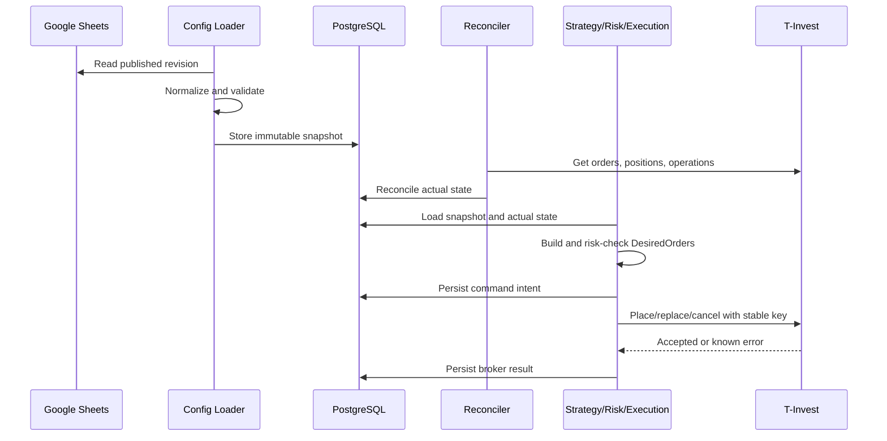

# Архитектура

## 1. Архитектурный стиль

MVP реализуется как modular monolith: один Go-процесс, одна PostgreSQL, чёткие границы модулей и внешние адаптеры. Это упрощает транзакции, эксплуатацию на одном выделенном сервере и восстановление состояния.

Разделение на отдельные сервисы допускается только после появления реальной потребности в независимом масштабировании.

## 2. Компоненты

### Config Loader

- Читает Google Sheets с интервалом 30 секунд.
- Загружает только `BOT_CONTROL` и `BOT_CONFIG`.
- Нормализует значения и вычисляет hash.
- Проверяет публикацию и сохраняет immutable snapshot.
- Не меняет активную конфигурацию частично.

### Instrument Registry

- Разрешает ticker в `instrument_uid` на этапе подготовки.
- Получает lot, currency, `min_price_increment`, торговый статус.
- Кэширует справочные данные с датой актуальности.
- Не позволяет переключить инструмент внутри существующей стратегии без новой ревизии.

### Strategy Engine

- Не выполняет I/O.
- Получает snapshot, состояние цикла и фактические исполнения.
- Рассчитывает `DesiredOrders`.
- Использует fixed-point цены.
- Детерминирован: одинаковый вход даёт одинаковый результат.

### Risk Engine

- Проверяет каждую желаемую команду непосредственно перед исполнением.
- Возвращает `allow` или список причин блокировки.
- Не изменяет брокерское состояние.

### Execution Engine

- Сравнивает `DesiredOrders` и `ActualOrders`.
- Формирует `PLACE`, `REPLACE`, `CANCEL`, `NOOP`.
- Сохраняет intent в БД до обращения к брокеру.
- Использует стабильный idempotency key.
- Не повторяет неопределённую команду, пока не завершён reconciliation.

### Broker Adapter

- Инкапсулирует T‑Invest API.
- Реализует sandbox и prod одним контрактом.
- Не содержит бизнес-правил лесенки.
- Преобразует protobuf-типы в доменные типы.

### Stream Consumers

- Рыночные данные.
- Состояния заявок и исполнения.
- Позиции/операции при необходимости.
- Следят за ping, переподключаются с backoff.
- После переподключения инициируют reconciliation.

### Reconciler

- Получает открытые заявки, их состояния, позиции и операции.
- Сопоставляет их с локальными intents.
- Закрывает неопределённые результаты.
- Необъяснимые внешние заявки и расхождения эскалирует оператору.

### Storage

- PostgreSQL repositories.
- Транзакции и advisory locks.
- Outbox для уведомлений и внутренних событий.
- Миграции применяются до запуска trader.

### Operations API

Минимальный HTTP API, доступный только через localhost/VPN:

- `GET /healthz` — процесс жив;
- `GET /readyz` — БД и обязательные зависимости доступны;
- `GET /metrics` — Prometheus;
- `GET /v1/status` — текущий режим и состояние стратегий;
- `POST /v1/reconcile` — запрос сверки;
- `POST /v1/pause` — запрет новых действий;
- `POST /v1/resume` — только возврат к режиму, разрешённому опубликованной конфигурацией;
- `POST /v1/cancel-open-orders` — отдельная защищённая операция, не часть обычной паузы.

## 3. Основной поток данных



## 4. Границы и интерфейсы

```go
type ConfigProvider interface {
    PublishedSnapshot(ctx context.Context) (ConfigSnapshot, error)
}

type StrategyEngine interface {
    Plan(snapshot ConfigSnapshot, cycle CycleState, actual BrokerState) (DesiredState, error)
}

type RiskEngine interface {
    Check(ctx context.Context, command TradingCommand, state RiskState) RiskDecision
}

type Broker interface {
    Instruments(ctx context.Context, ids []InstrumentID) ([]Instrument, error)
    State(ctx context.Context, accountID string) (BrokerState, error)
    Place(ctx context.Context, command PlaceOrder) (Order, error)
    Replace(ctx context.Context, command ReplaceOrder) (Order, error)
    Cancel(ctx context.Context, command CancelOrder) error
    Subscribe(ctx context.Context, accountID string) (<-chan BrokerEvent, <-chan error)
}
```

Сигнатуры концептуальные и уточняются после выбора gRPC-клиента.

## 5. Конкурентность

- На стратегию работает последовательный event loop.
- Внутри стратегии события сериализуются по `strategy_id`.
- Перед применением команды берётся PostgreSQL advisory lock на account/strategy.
- Внешние stream-события допускают повторную доставку.
- Несколько goroutine могут читать события, но переход состояния выполняется одной транзакцией.

## 6. Обработка отказов

| Сбой | Поведение |
|---|---|
| Google Sheets недоступна | Работает текущий snapshot; новая ревизия не применяется |
| T‑Invest stream разорван | Новые действия приостанавливаются, выполняется reconnect и reconciliation |
| Ответ `PostOrder` потерян | Команда становится `UNKNOWN`, повтор запрещён до поиска по idempotency key |
| PostgreSQL недоступна | Торговые действия запрещены |
| Котировка устарела | Новые команды запрещены; существующие заявки не снимаются автоматически |
| Неизвестная внешняя заявка | Стратегия блокируется, оператор получает уведомление |
| Второй экземпляр trader | Не получает lock и остаётся not-ready |

## 7. Наблюдаемость

Минимальные метрики:

- `trader_config_revision`;
- `trader_strategy_state`;
- `trader_broker_requests_total`;
- `trader_broker_errors_total`;
- `trader_order_commands_total`;
- `trader_reconciliation_mismatches_total`;
- `trader_stream_connected`;
- `trader_stream_last_event_timestamp`;
- `trader_risk_rejections_total`;
- `trader_open_orders`;
- `trader_reserved_rub`.

Каждый log/event содержит `trace_id`, `strategy_id`, `cycle_id`, `command_id`; токены и полный account ID маскируются.
